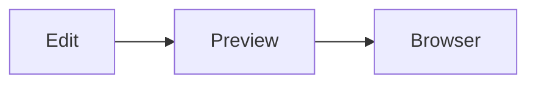

# Markdown preview playground

This paragraph tests **bold**, *italic*, `inline code`, and a [link](https://example.com).

## Lists

- one
- two
  - nested item
- three

1. first
2. second
3. third

## Tasks

- [x] working fixture
- [ ] test MarkdownPreview

## Table

| Feature | Expected |
| --- | --- |
| Heading | Rendered heading |
| Code | Syntax-highlighted block |
| Table | HTML table |

## Code

```ts
const message: string = "hello markdown preview";
console.log(message);
```

## Diagram-like fenced block



TELESCOPE_NEEDLE markdown fixture.
